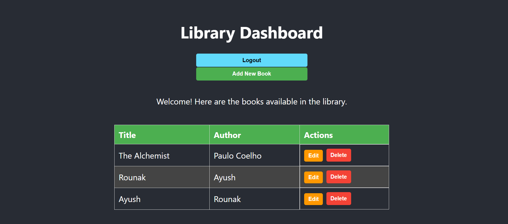

# Library Management System



A complete full-stack MERN (MongoDB, Express, React, Node.js) application built from scratch to manage a library's books and users.

---

## Features

- **User Authentication:** Secure user registration and login system using JSON Web Tokens (JWTs).
- **Role-Based Access Control:** Differentiates between `Admin` and `User` roles. Admins have full control, while public users have read-only access.
- **Full CRUD Functionality:** Admins can Create, Read, Update, and Delete books in the library.
- **Dynamic Frontend:** A responsive user interface built with React and React Router for seamless navigation.
- **File Uploads:** Functionality for uploading book files and cover images.

---

## Tech Stack

- **Frontend:**
  - React
  - React Router

- **Backend:**
  - Node.js
  - Express.js

- **Database:**
  - MongoDB Atlas

- **Authentication & Security:**
  - JSON Web Tokens (JWT)
  - bcrypt.js for password hashing

---

## How to Run Locally

1. **Clone the repository:**
   ```bash
   git clone <your-repo-url>